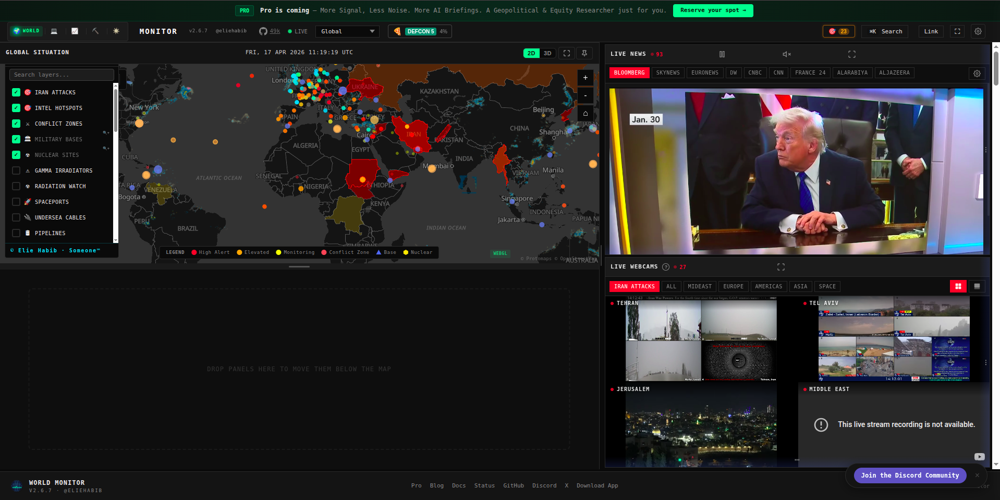
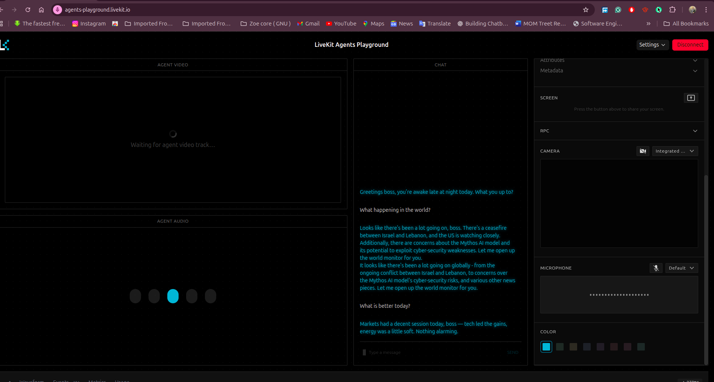

# Mission Control Demo

Mission Control Demo is a voice-first assistant project built around a FastMCP server and a LiveKit voice worker. It is designed for world briefings, tool-assisted voice interactions, and visual handoff to World Monitor after a spoken update.

The project focuses on two core runtime components:

- an MCP server that exposes tools over SSE
- a LiveKit voice worker that handles STT, LLM reasoning, and TTS

## Product Snapshot

- Real-time voice workflow using configurable STT, LLM, and TTS providers
- FastMCP server exposed over SSE for tool calls and external integrations
- LiveKit Playground support for microphone-based testing
- Optional World Monitor launch after a live news briefing
- Docker Compose setup for the server and voice worker

## Screenshots

These screens represent the live operator experience around the voice agent during runtime.

### World Monitor In Action

This is the visual monitoring surface the agent opens after a world briefing. It gives the user a live geopolitical map, a news wall, and webcam-based context for ongoing events.



### LiveKit Playground Conversation

This is the LiveKit Playground session used to test the assistant in real time. The user can speak to the agent, receive the generated reply, and review the transcript in the same view.



## Overview

The project is split into two main parts:

| Component | Purpose |
|-----------|---------|
| **MCP Server** | Exposes tools such as world news, web fetch, and system utilities over SSE. |
| **Voice Agent** | Runs the LiveKit-powered voice pipeline for speech-to-text, LLM reasoning, and text-to-speech. |

## Architecture

```text
Microphone -> STT -> LLM -> TTS -> Speaker
                   |
                   v
        MCP Server (FastMCP over SSE)
            |- get_world_news
            |- open_world_monitor
            |- fetch_url
            `- system utilities
```

The voice worker connects to the MCP server at `http://127.0.0.1:8000/sse`.

## Project Structure

```text
mission-control-demo/
├── mission_control_server.py       # MCP server entry point
├── mission_control_agent.py        # LiveKit voice worker entry point
├── main.py                         # Simple local hello stub
├── pyproject.toml                  # Project metadata and CLI scripts
├── .env.example                    # Environment template
├── docker-compose.yml              # Docker Compose stack
├── Dockerfile                      # Container build definition
└── mission_control/                # MCP package
    ├── config.py
    ├── prompts/
    ├── resources/
    └── tools/
```

## Quick Start

### 1. Prerequisites

- Python 3.11 or newer
- `uv`
- A LiveKit Cloud project

Install `uv` if needed:

```bash
pip install uv
```

### 2. Install dependencies

```bash
cd mission-control-demo
uv sync
```

### 3. Configure environment variables

```bash
cp .env.example .env
```

Fill in the required credentials in `.env`.

### 4. Start the MCP server

Terminal 1:

```bash
uv run mission_control
```

### 5. Start the voice worker

Terminal 2:

```bash
uv run mission_control_voice
```

### 6. Connect the voice interface

Open the LiveKit Agents Playground:

```text
https://agents-playground.livekit.io
```

Connect it to the same LiveKit project configured in `.env`, allow microphone access, and start speaking to the agent.

## Docker Setup

The repository includes a Docker Compose stack for the MCP server and voice worker.

### 1. Prepare the environment file

```bash
cd mission-control-demo
cp .env.example .env
```

Populate `.env` with the provider and LiveKit credentials you want the containers to use.

Recommended provider setup for the current code:

```env
STT_PROVIDER=groq
LLM_PROVIDER=groq
TTS_PROVIDER=openai
ENABLE_BROWSER_LAUNCH=false
```

`ENABLE_BROWSER_LAUNCH=false` is useful in Docker so the backend returns the monitor URL instead of trying to open a browser inside the container.

### 2. Build and start the stack

```bash
docker compose build
docker compose up -d
```

### 3. Check container health

```bash
docker compose ps
```

Expected services:

- `mission-control-server`
- `mission-control-voice`

### 4. Open the published endpoint

```text
http://127.0.0.1:8000/sse
```

### 5. Follow logs when needed

```bash
docker compose logs -f mission-control-server
docker compose logs -f mission-control-voice
```

### 6. Stop the stack

```bash
docker compose down
```

## Command Reference

| Command | Description |
|---------|-------------|
| `uv run mission_control` | Starts the FastMCP server on port `8000`. |
| `uv run mission_control_voice` | Starts the LiveKit voice worker in dev mode. |
| `docker compose up -d` | Starts the Docker stack. |
| `docker compose down` | Stops the Docker stack. |

## Environment Variables

The project supports multiple providers. At minimum, configure the keys required by the providers you plan to use.

| Variable | Required | Notes |
|----------|----------|-------|
| `LIVEKIT_URL` | Yes | LiveKit Cloud project URL |
| `LIVEKIT_API_KEY` | Yes | LiveKit API key |
| `LIVEKIT_API_SECRET` | Yes | LiveKit API secret |
| `OPENAI_API_KEY` | Usually yes | Required for OpenAI TTS and Whisper fallback |
| `GROQ_API_KEY` | If using Groq | Required when `STT_PROVIDER=groq` or `LLM_PROVIDER=groq` |
| `GOOGLE_API_KEY` | If using Gemini | Required when `LLM_PROVIDER=gemini` |
| `SARVAM_API_KEY` | If using Sarvam | Required when `STT_PROVIDER=sarvam` or `TTS_PROVIDER=sarvam` |
| `DEEPGRAM_API_KEY` | Optional | Only if you extend the stack to use Deepgram |
| `SUPABASE_URL` | Optional | For ticketing or data-backed tools |
| `SUPABASE_API_KEY` | Optional | For ticketing or data-backed tools |
| `ENABLE_BROWSER_LAUNCH` | Optional | Enables or disables browser launch for the world monitor tool |
| `WORLD_MONITOR_URL` | Optional | Override for the world monitor destination |

## Provider Selection

The voice worker reads provider choices from `.env`:

```env
STT_PROVIDER=groq
LLM_PROVIDER=groq
TTS_PROVIDER=openai
```

Available defaults in the current code:

- `STT_PROVIDER`: `sarvam`, `whisper`, or `groq`
- `LLM_PROVIDER`: `gemini`, `openai`, or `groq`
- `TTS_PROVIDER`: `openai`, `sarvam`, or `groq`

## Runtime Flow

- Use LiveKit Playground for microphone-based conversation with the voice agent.
- The voice worker calls MCP tools over SSE when it needs live data or actions.
- When the agent triggers the world monitor action, the monitor opens in a separate browser tab.

## Extending the MCP Tools

To add a new tool:

1. Create or edit a module inside `mission_control/tools/`
2. Define a `register(mcp)` function
3. Decorate tools with `@mcp.tool()`
4. Import and register the module in `mission_control/tools/__init__.py`

## Technology Stack

- FastMCP
- LiveKit Agents
- OpenAI
- Groq
- Google Gemini
- Sarvam
- httpx
- uv

## License

Apache 2.0
